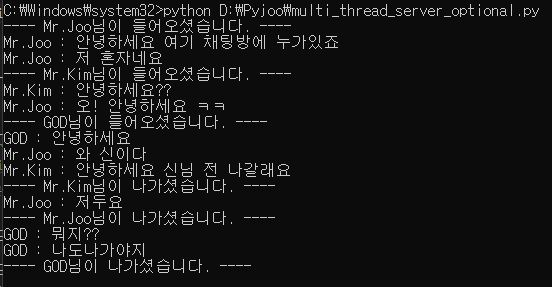
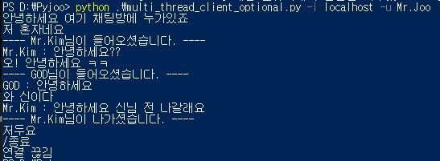
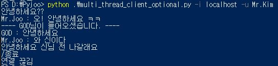
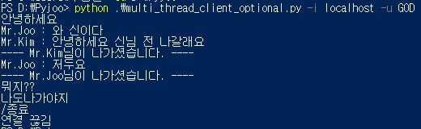

# Multi-Threading-Chat-Server
Multi-Threading TCP chat server in Python

## o Getting Started  
  Chat program in a multi-threading server environment.    
  This is a simple chat server with only a few features.  

## o Development Environment  
    Language :  
      Python 3.7.4  
    Libraries :  
      socket  
      argparse  
      threading  
      time  

## o How to use  
  1. Run the server code on the server with -p(optional) option.    
  2. Run the client code on the client with -i, -u, -p(optional) option.  
  3. Let's chat!  
  4. If you want exit, input "/종료".  
  
  - Option description.  
    -p : port  
    -i : ip  
    -u : username  
  
## o Screenshots  

  
  
  
 -server 
  
  
  
 -client 1 
  
  
  
 -client 2 
  
  
  
 -client 3 
  

  

## o License  
  This project is under MIT license. See the [LICENSE](https://github.com/Sungmin-Joo/Multi-Threading-Chat-Server/blob/master/LICENSE) file for more info.  
